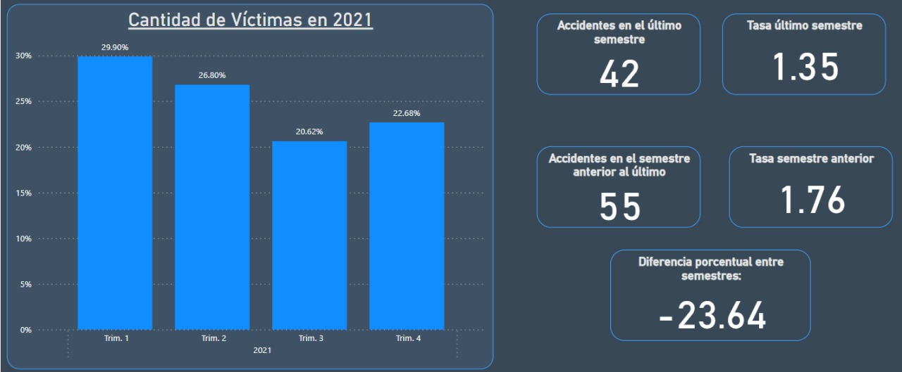
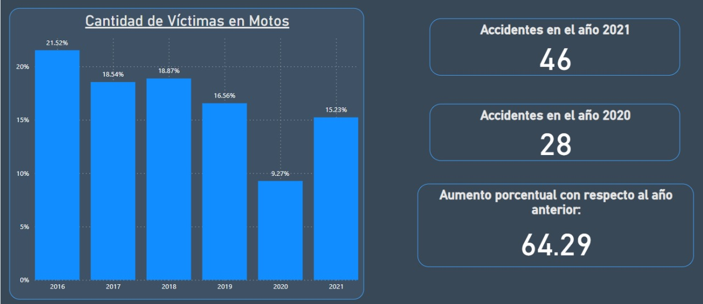

# <h1 align="center">**Siniestros Viales en la Ciudad Autónoma de Buenos Aires**</h1>

## Introducción:  

Este proyecto busca simular el rol de un analista de datos que trabaja para el Observatorio de Movilidad y Seguridad Vial (OMSV), centro de estudios que se encuentra bajo la órbita de la Secretaría de Transporte del Gobierno de la Ciudad Autónoma de Buenos Aires, se nos solicita la elaboración de un proyecto de anális de datos, con el fin de generar información que le permita a las autoridades locales tomar medidas para disminuir la cantidad de víctimas fatales de los siniestros viales. 

Este proyecto tiene como objetivo analizar datos de accidentes de tráfico en la Ciudad Autónoma de Buenos Aires (CABA), se dispone un dataset con los accidentes registrados entre 2016 y 2021. Se espera la entrega de un informe detallado y un panel interactivo para facilitar la interpretación y el análisis de la información.

## Ubicación y Contexto:

La Ciudad Autónoma de Buenos Aires (CABA) es una de las veinticuatro entidades federales y capital de la República Argentina. Está situada en la región centro-este del país, sobre la orilla occidental del Río de la Plata, en plena llanura pampeana. El Río de la Plata (al este y al norte) y el Riachuelo (al sur) son los límites naturales de la Ciudad Autónoma de Buenos Aires.

La superficie de la Ciudad es algo superior a los 200 km2 y su perímetro, 60 km. Cerca de tres millones de habitantes (3.121.707 habitantes, fuente: Censo 2022) residen en ella distribuidos en barrios que, desde el punto de vista político-administrativo, se agrupan en quince comunas. La densidad de la población es de más de 15.000 habitantes por kilómetro cuadrado. Las zonas centro y norte son los espacios territoriales más densamente poblados. Según la Dirección General de Estadísticas y Censos, el parque automotor de CABA registró provisoriamente 1.618.874 vehículos (Febrero de 2024).

Por solo estos datos sin necesidad de añadir más los siniestros viales son una preocupación de alta urgencia en la Ciudad.

## Datos:

Dataset: *homicidios* que se encuentra en formato de Excel y contiene dos pestañas de datos:

* **HECHOS**: que contiene una fila de hecho con id único y las variables temporales, espaciales y participantes asociadas al mismo.

* **VICTIMAS**: contiene una fila por cada víctima de los hechos y las variables edad, sexo y modo de desplazamiento asociadas a cada víctima. Se vincula a los *HECHOS* mediante el id del hecho.

En este [link](https://docs.google.com/spreadsheets/d/1nq00jGIZHQ1RLSET43zKnUsMsoFb-pBg/edit#gid=1625530738) se encuentran los datos utilizados en el análisis.

## Tecnologías utilizadas:

**Etapas Tecnológicas:**  
* Primera Etapa: En esta etapa nos enfocamos en la extracción de los datos, su conversión en dataframes, la verificación en la calidad de los mismos y en un análisis exploratorio mediante graficas y tener métricas para realizar observaciones. Para esta etapa usamos Python con las siguientes librerías: Pandas, Seaborn y Matplotlib.

* Segunda Etapa: La segunda etapa consistía en poder visualizar los KPIs (indicadores clave de rendimiento) así como datos relevantes para poder analizar y verificar si se cumplieron los objetivos planteado en este proyecto. Para esta etapa usamos Power bi.  

# <h1 align="center">**Paso a Paso**</h1>

## **Análisis Exploratorio de Datos (EDA)**

En esta sección, llevamos a cabo la extracción de datos y verificamos su integridad mediante la identificación de valores faltantes, duplicados y nulos. Además, realizamos un análisis de outliers para determinar si estos valores eran simplemente atípicos o si indicaban errores en los datos. Es importante destacar que este proceso se aplicó a ambos dataframes al unir ambos en uno solo.

Utilizamos gráficos para analizar métricas específicas, lo que nos permitió identificar datos relevantes que podrían ser útiles para análisis futuros. También verificamos los resultados de las dos KPIs clave.

***Se realizaron las siguientes actividades clave:***

* Análisis de Distribución: La investigación de la distribución de accidentes en diferentes momentos, lugares y condiciones ayudó a identificar patrones y puntos críticos, esenciales para dirigir intervenciones.

* Estudio de Correlación: Se realizó un análisis detallado para explorar las correlaciones entre diversos factores como los momentos de los accidentes, lugares y  tipos de vehículos.

* Representaciones Gráficas: Se utilizaron diversas técnicas de visualización para comprender y comunicar mejor los datos.

* Generación de Ideas: El proceso de EDA condujo a varias ideas clave, como la identificación de áreas y el impacto de tipos específicos de vehículos en las tasas de accidentes. Estas ideas fueron cruciales para formular medidas y intervenciones de seguridad específicas.  

Los hallazgos del EDA fueron cruciales para dar forma a las etapas posteriores del proyecto, especialmente en el desarrollo del panel de Power BI y de los Indicadores Clave de Rendimiento (KPIs).

## **Indicadores Clave de Rendimiento (KPIs)**

**Se definieron dos KPI's**

1) Reducir en un 10% la tasa de homicidios en siniestros viales de los últimos seis meses, en CABA, en comparación con la tasa de homicidios en siniestros viales del semestre anterior.

2) Reducir en un 7% la cantidad de accidentes mortales de motociclistas en el último año, en CABA, respecto al año anterior.  

Podemos observar el cumplimiento de la primera KPI, se redujo en un 23% la tasa de homicidios en CABA con respecto al semestre anterior al actual:

Podemos observar que no se cumplio la segunda KPI, en realidad hubo un aumento del 64% en accidentes donde las víctimas se transportaban en moto con respecto al 2020:

## **Power BI**

El Dashboard en Power BI es una pieza fundamental del proyecto, diseñado para presentar datos complejos de manera accesible y visualmente atractiva. El Dashboard cumple múltiples funciones, desde resaltar tendencias clave hasta permitir un análisis detallado. Los siguientes componentes son los más importantes:

* Página de Análisis: Se realiza un análisis temporal de los datos con gráficos interactivos que muestran las tendencias de accidentes en diferentes periodos de tiempo, permitiendo a los usuarios observar patrones y cambios.

* Página de Análisis de Víctimas: Se realiza un análisis de los roles en el accidente, vehículos, edades y géneros de las víctimas con gráficos interactivo, con filtros para años y meses.

* Página de Análisis de Ubicaciones: Gráficos y mapas que muestran los tipos de calles y condiciones (si es cruce o no) de los accidentes, hay un mapa visual que señala los puntos críticos de accidentes dentro de la ciudad, ayudando a identificar áreas que requieren atención.

* Páginas de KPI's: Cada KPI tiene su página dedicada, permitiendo un análisis detallado de las métricas específicas y su impacto en la seguridad vial. Estas páginas incluyen:

Visualización de KPI: Gráficos que rastrean el progreso de cada KPI contra sus objetivos, ofreciendo una vista clara del resultado de cada una.

## Conclusiones:

Estas son algunas conclusiones derivadas del análisis tanto en el EDA con en el Dashboard:

**Cantidad de Accidentes Registrados: 717**  

- El 76.82% de las víctimas son hombres.

- El vehículo con más víctimas es la moto con un 42% de los casos, seguido por los peatones con un 37% (de los cuales el 14% son mujeres).

- El 23% de las víctimas son mujeres y su rol de más riesgo es ser peatón.

- El 61% de los accidentes fatales ocurren en avenidas y el 50% de estos casos son en cruces, el segundo tipo de vía más mortal son las calles con un 19% de los accidentes.

- El 37% de las víctimas son adultos entre 30 y 50 años y el 31% son adultos jóvenes entre 18 y 30 años, seguidos por adultos mayores (15%), ancianos (12%) y menores de edad (3%).

- El mes con más accidentes es diciembre con el 11%.

- El año con más víctimas es el 2018 (20,6%), seguido muy de cerca por el 2016 (20,4%)

- La primera KPI se cumplio, más la segunda fallo.  

# Autor:

- Correo: xdanielyalejandro@hotmail.com
- Github: [GitHub](https://github.com/DanielHernandezZambrano)
